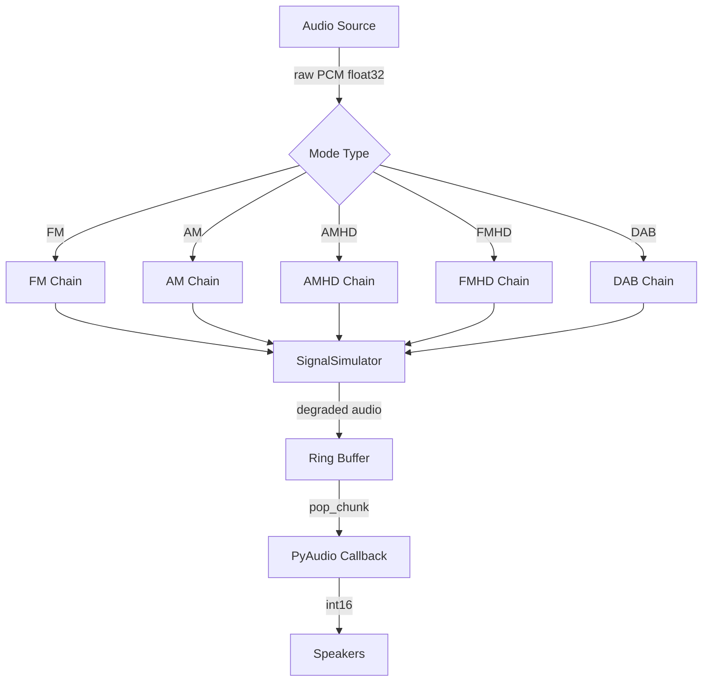
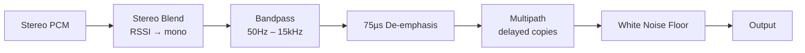
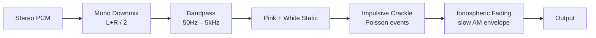
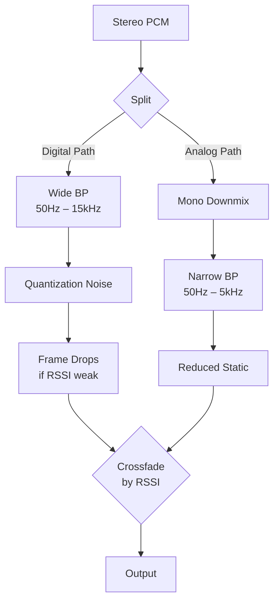
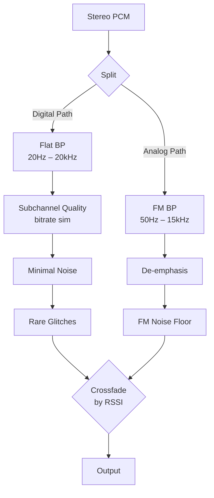
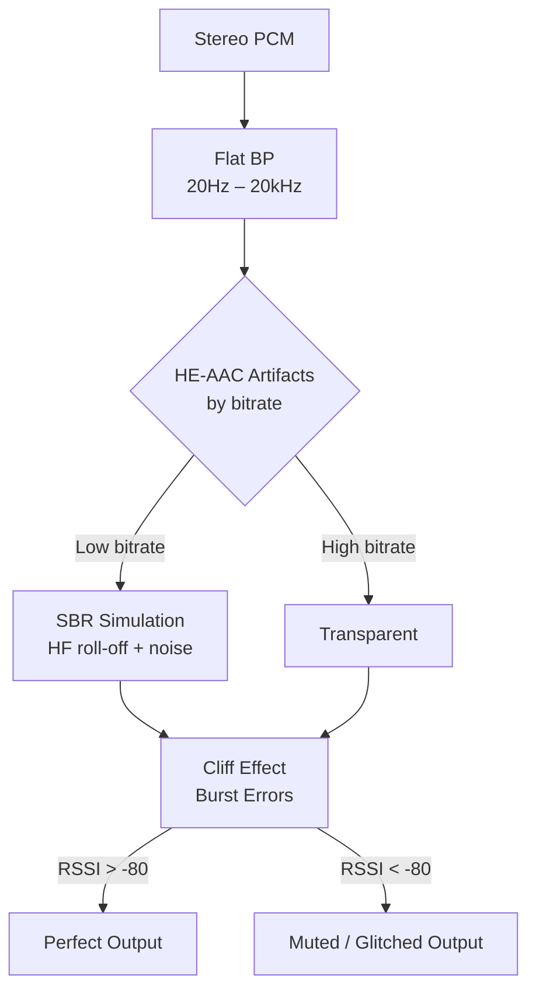
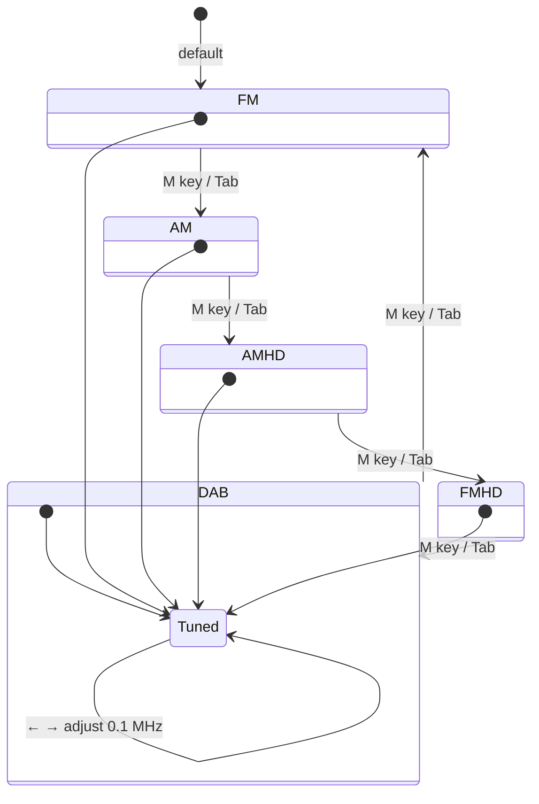
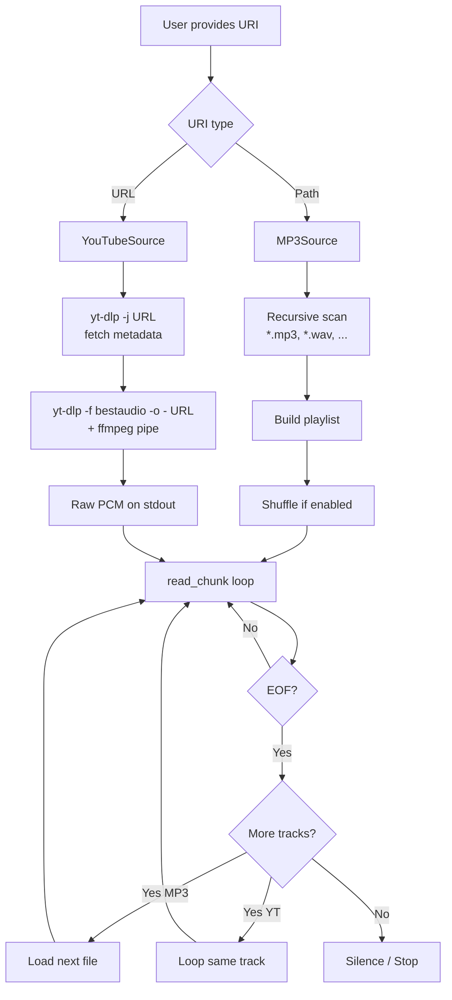
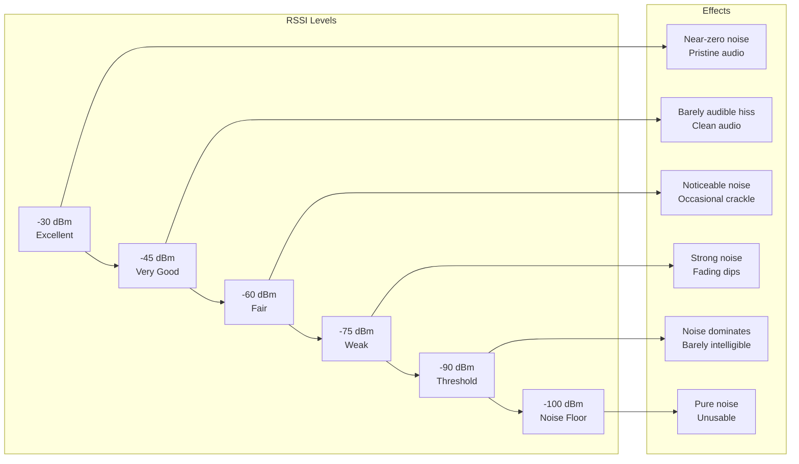

# RadioSim — Signal Flowcharts

## Audio Pipeline Flow

## FM Processing Chain

## AM Processing Chain

## AMHD Hybrid Chain

## FMHD Hybrid Chain

## DAB+ Processing Chain

## Tuning State Machine

## Source Lifecycle

## RSSI → Noise Mapping

